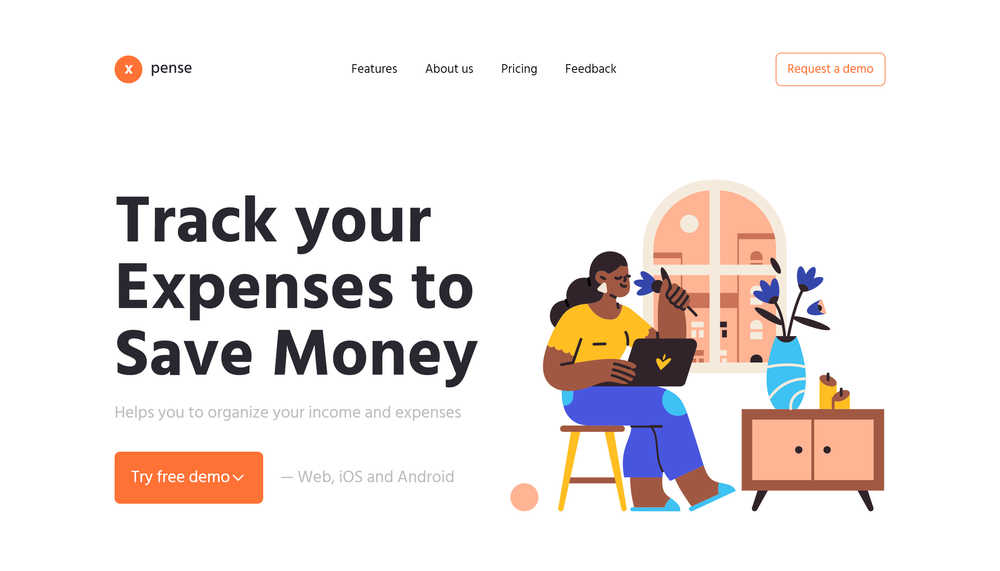

# Xpense

UI design for a financial management platform, crafted to offer users an intuitive, visually appealing, and efficient interface. Emphasizing a clean layout, visually appealing elements, and responsive design, the interface ensures a seamless user experience across various devices.

## Demo

LIVE: [Xpense](https://hrs-xpense.netlify.app/)

## Screenshot

## Tech Stack

Yarn Vite React Tailwind

## Author

### Hubert Śleszyński

Portfolio: https://hrs-dev.netlify.app/

Linkedin: https://www.linkedin.com/in/hubertsleszynski/

Github: https://github.com/HubertSleszynski
